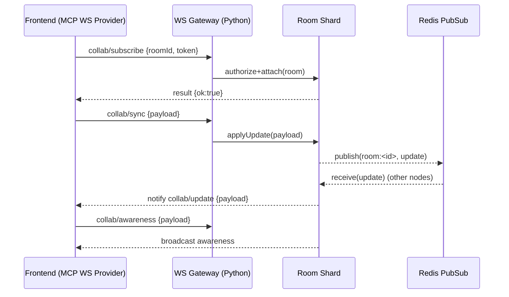

# Swarm 2B — Real‑Time Collaboration Service Handoff (Python Backend API Lead)

Date: 2025-09-17
Owner: python-backend-api lead (mfodpv0o-nopz8)
Contributors: mcp-protocol-expert
Status: Ready for implementation (Phase 2B)

## Stakeholder Summary
- Goal: Stand up a secure, low‑latency, horizontally scalable collaboration service that speaks MCP‑compatible JSON‑RPC over WebSocket and relays Yjs CRDT updates and awareness.
- Success looks like: sub‑150ms p95 remote keystroke echo, consistent CRDT convergence across 3+ clients, robust auth/RBAC, backpressure under burst, and actionable metrics/alerts.
- What you have: Frontend adapter and protocol docs ready; no runtime coupling to unblock backend.

References:
- Protocol: docs/collaboration/mcp-websocket-protocol.md
- Monitoring/diagnostics: docs/collaboration/monitoring-diagnostics.md
- Auth patterns: docs/mcp-authentication-architecture.md, docs/websocket-authentication.md

## Scope & SLAs
- Transport: WebSocket (`wss` in prod), JSON‑RPC 2.0 control, Yjs payloads (binary preferred, JSON base64 fallback).
- Latency targets: p50 RTT < 50ms dev/LAN, p95 RTT < 150ms WAN.
- Scale targets (initial): 5k concurrent conns/node, 100 participants/room soft cap, 5k rooms/node.
- Throughput targets: ≥ 60 msgs/min per client sustained; bursts 200 msgs/5s with backpressure.

## External Interface
- Endpoint: `GET /collab/ws` (Upgrades to WS). Port recommendation: 3005 in dev, 443 behind gateway in prod.
- Subprotocols: `mcp-json` (default), `mcp-binary` (optional future use).
- Auth: `Authorization: Bearer <jwt|wsToken>` header and/or `?token=...`; `mcp-session-id` header is optional for MCP context.
- Room naming: `ws:<workspaceId>/<documentId>`.

### JSON‑RPC Methods
- `collab/subscribe(params: { roomId, sessionId?, token?, capabilities? }) → result: { ok: true }`
- `collab/sync(params: { roomId, seq, payloadB64 }) → result: { applied, version }`
- `collab/update(params: { roomId, seq, sid?, payloadB64 }) → result: { applied, version }`
- `collab/awareness(params: { roomId, seq, sid?, payloadB64 }) → result: { ok: true }`
- `collab/heartbeat(params: { ts }) → result: { ts, serverTs }`
- `collab/room.info(params: { roomId }) → result: { roomId, participants, roles?, rateLimit? }`

Error codes: `UNAUTH(401)`, `FORBIDDEN(403)`, `ROOM_NOT_FOUND(404)`, `RATE_LIMIT(429)`, `PAYLOAD_TOO_LARGE(413)`, `INTERNAL(500)`.

### Binary Frames (optional)
- Type tags (1 byte): `0x01 update`, `0x02 awareness`, `0x03 sync`, `0x10 heartbeat`. Payload is raw Yjs bytes.

## Backend Architecture (Python)
- Gateway: HTTP server that upgrades to WS, validates JWT, derives `user`, `workspace`, `permissions`.
- Router: Shard by `hash(roomId) % N`, per‑room mailbox FIFO within shard.
- Fanout: Redis pub/sub channel `room:<roomId>` to broadcast updates across nodes.
- State: In‑memory Yjs doc per room (authoritative within shard). Optional periodic snapshotting for recovery.
- Rate limiting: Redis‑backed token buckets by `{userId}`, `{roomId}`, and message type.

### Minimal Data Model (in‑memory)
```ts
Connection { id, user { id, roles }, rooms: Set<roomId>, lastActivity }
RoomState { id, ydoc, participants: Set<userId>, lastSeqByConn: Map<connId, number> }
```

## Security & Auth
- Accept JWT issued by auth service; on `subscribe`, verify room permissions (RBAC read/write/admin).
- Reject unauthenticated connections within 30s (close 1008 Auth timeout).
- Enforce payload caps: 32KB updates, 8KB awareness; drop oversize with `PAYLOAD_TOO_LARGE`.
- Require TLS in prod; origin allowlist; DNS rebinding protection at gateway.

## Message Flow (Mermaid)


## Implementation Checklist
1. WebSocket server
   - Upgrade handler `GET /collab/ws` with `mcp-json` subprotocol.
   - Connection registry + auth timeout (30s) + heartbeat (30s).
2. AuthN/Z
   - Verify JWT, map to user, fetch roles/permissions (workspace/document scope).
   - Enforce RBAC per method (`read` for subscribe, `write` for update).
3. Room lifecycle
   - `getOrCreate(roomId)`: create RoomState, load snapshot if present.
   - Track participants; notify join/leave (optional).
4. CRDT apply/broadcast
   - Apply Yjs update; publish to Redis channel `room:<id>`.
   - On pub/sub receive, fanout to local participants.
5. Rate limiting & backpressure
   - Token buckets per `message|join|auth` using Redis.
   - Per‑connection outbox watermark; pause reads on high watermark.
6. Monitoring & logs
   - Prometheus metrics per docs/collaboration/monitoring-diagnostics.md.
   - Structured JSON logs with `roomId`, `seq`, `userId`, `latency_ms`.
7. Error handling
   - Map exceptions to error codes; graceful close codes 1008/1013/1011.
8. Shutdown & resilience
   - Drain connections; persist room snapshots (optional); close Redis cleanly.

## Suggested Python Skeleton (illustrative)
```python
# app/collab/ws.py (illustrative only)
import json, time, asyncio, base64
from typing import Dict, Any
from websockets.asyncio.server import serve
import aioredis

class CollabServer:
    def __init__(self, redis_url: str):
        self.redis = None
        self.rooms: Dict[str, Room] = {}
        self.connections: Dict[str, Conn] = {}
        self.redis_url = redis_url

    async def start(self, host="0.0.0.0", port=3005):
        self.redis = await aioredis.from_url(self.redis_url)
        async with serve(self._handler, host, port, subprotocols=["mcp-json"]):
            await asyncio.Future()

    async def _handler(self, ws):
        conn = Conn(ws)
        try:
            await self._auth_timeout(conn)
            async for raw in ws:  # text frames
                msg = json.loads(raw)
                await self._dispatch(conn, msg)
        except Exception:
            pass
        finally:
            await self._disconnect(conn)

    async def _dispatch(self, conn, msg: Dict[str, Any]):
        m, p, id_ = msg.get("method"), msg.get("params", {}), msg.get("id")
        if m == "collab/subscribe":
            await self._subscribe(conn, p)
            await conn.result(id_, {"ok": True})
        elif m in ("collab/update", "collab/sync"):
            room = self.rooms[p["roomId"]]
            update = base64.b64decode(p["payloadB64"])  # Yjs update bytes
            await room.apply_and_broadcast(update, exclude=conn)
            await conn.result(id_, {"applied": True})
        elif m == "collab/awareness":
            await room.broadcast_awareness(p["payloadB64"], exclude=conn)
            await conn.result(id_, {"ok": True})
        elif m == "collab/heartbeat":
            await conn.result(id_, {"ts": p["ts"], "serverTs": int(time.time()*1000)})
        else:
            await conn.error(id_, 400, "Unknown method")
```

> Note: Integrate JWT verification, RBAC checks, rate‑limits, and Redis pub/sub in the real implementation. For Yjs, either embed a Python CRDT doc or treat the server as a relay and let clients converge (less authoritative).

## Configuration
- Env (examples):
  - `REDIS_URL=redis://localhost:6379/0`
  - `JWT_SECRET=...` or JWKS settings
  - `ALLOWED_ORIGINS=http://localhost:3000`
  - `COLLAB_MAX_UPDATE_BYTES=32768`
- Ports: 3005 (dev). Do not use 3001.

## Test & Validation Plan
- Unit
  - Validate method schema; reject oversize payloads; auth failures within 30s.
- Integration
  - 3 clients join → sync → update round‑trip convergence tests (Yjs apply on all clients).
  - RBAC: writer vs reader update rejection.
- Load
  - 100 users/room, 60 msg/min/client for 5 minutes; ensure no OOM, backpressure triggered ≤ 5% time.
- Observability
  - Prometheus emits: `collab.rtt_ms`, `apply_duration_ms`, `msg_in/out`, `bytes_in/out`, `rate_limited`, `backpressure_on`.
- Acceptance
  - Meets SLAs, zero critical security issues, metrics/alerts configured.

## Rollout Plan
1. Dev bring‑up on port 3005 with mocked JWT.
2. Add Redis fanout + rate limits.
3. Wire to real JWT/permissions.
4. Enable metrics + alerts.
5. Gate to a single workspace; monitor; scale shards.

## Risks & Mitigations
- Hot rooms (>200 participants): autoscale shards; enforce room caps; split by document sections (future).
- Burst floods: backpressure + server ACK timeouts with client resend.
- Token leakage: short‑lived wsTokens; origin allowlist; audit logs.

## Integration Notes (Frontend)
- Provider: `MCPWebSocketCollaborationProvider` (src/lib/editor/collaboration/mcp-ws-provider.ts).
- Env: `NEXT_PUBLIC_COLLAB_WS_URL=ws://localhost:3005/collab/ws` (dev).
- Messages: JSON‑RPC with base64 Yjs updates by default.

## Open Questions
- Do we persist document snapshots/versions here or delegate to content service?
- Do we support presence throttling (e.g., 10 Hz cap) at server level?

---
Prepared for mfodpv0o-nopz8. Ping mcp-protocol-expert for any clarifications.

